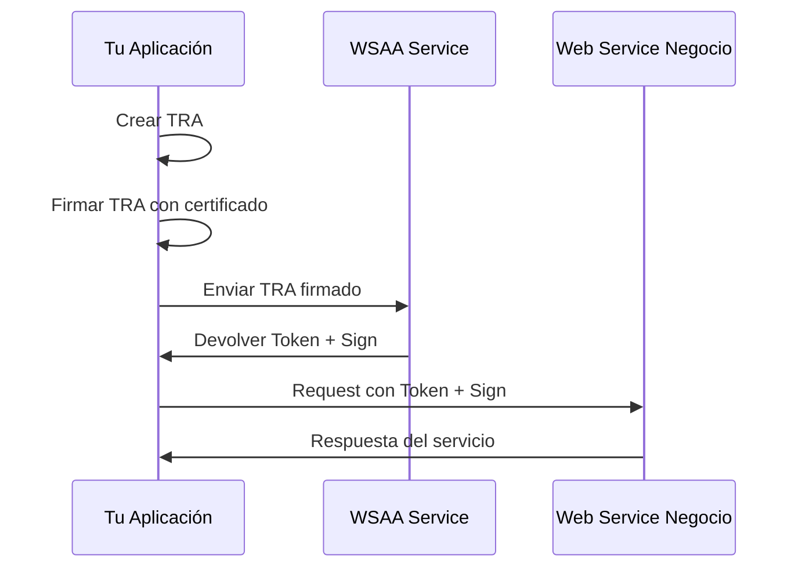

# Guía de Integración AFIP Real

## 🎯 Objetivo

Esta guía te ayudará a conectar la POC con los servicios reales de AFIP, tanto para desarrollo/testing como para producción.

## 📋 Índice

- [URLs y Endpoints](#urls-y-endpoints)
- [Certificados Digitales](#certificados-digitales)
- [Proceso de Autenticación](#proceso-de-autenticación)
- [Implementación](#implementación)
- [Testing](#testing)
- [Troubleshooting](#troubleshooting)

---

## 🌐 URLs y Endpoints

### **Entorno de Homologación (Testing)**

```javascript
const HOMOLOGATION_ENDPOINTS = {
  // Web Services SOAP
  wsaa: 'https://wswhomo.afip.gov.ar/wsaa/service.asmx',
  wsfev1: 'https://wswhomo.afip.gov.ar/wsfev1/service.asmx',
  padron: 'https://wswhomo.afip.gov.ar/ws_sr_padron_a4/service.asmx',
  
  // API REST (más rápida)
  restAPI: 'https://aws.afip.gob.ar/sr-padron/v2'
};
```

### **Entorno de Producción**

```javascript
const PRODUCTION_ENDPOINTS = {
  // Web Services SOAP
  wsaa: 'https://servicios1.afip.gov.ar/wsaa/service.asmx',
  wsfev1: 'https://servicios1.afip.gov.ar/wsfev1/service.asmx',
  padron: 'https://servicios1.afip.gov.ar/ws_sr_padron_a4/service.asmx',
  
  // API REST
  restAPI: 'https://soa.afip.gob.ar/sr-padron/v2'
};
```

### **Endpoints Específicos**

#### API REST Pública (Sin autenticación)
```bash
# Información de contribuyente
GET https://soa.afip.gob.ar/sr-padron/v2/persona/{CUIT}

# Constancia de inscripción
GET https://soa.afip.gob.ar/sr-padron/v1/constancia/{CUIT}

# Búsqueda por DNI
GET https://soa.afip.gob.ar/sr-padron/v2/personas/{DNI}

# Ejemplo práctico
curl "https://soa.afip.gob.ar/sr-padron/v2/persona/20123456789"
```

---

## 🔐 Certificados Digitales

### **Paso 1: Registro en WSASS (Homologación)**

1. **Ingresar a AFIP** con Clave Fiscal
2. **Ir a**: Administrador de Relaciones de Clave Fiscal
3. **Adherir Servicio**: WSASS (Autoservicio APIs Homologación)
4. **Acceder a WSASS**: Desde servicios habilitados

### **Paso 2: Generar Certificado**

#### Opción A: Desde WSASS (Recomendado)
```bash
# 1. Generar CSR (Certificate Signing Request)
openssl req -new -newkey rsa:2048 -nodes -keyout private.key -out request.csr

# 2. Subir CSR a WSASS
# 3. Descargar certificado generado (.crt)
# 4. Convertir a PFX si es necesario
openssl pkcs12 -export -out certificate.pfx -inkey private.key -in certificate.crt
```

#### Opción B: Línea de Comandos Completa
```bash
# Generar clave privada
openssl genrsa -out private.key 2048

# Generar CSR
openssl req -new -key private.key -out request.csr -subj "/C=AR/O=TuEmpresa/CN=TuNombre/serialNumber=CUIT 20123456789"

# El CSR se carga en WSASS y se descarga el certificado
```

### **Paso 3: Configurar Certificados en el Proyecto**

```bash
# Crear directorio para certificados
mkdir -p certs

# Copiar archivos
cp /path/to/certificate.crt certs/
cp /path/to/private.key certs/

# Configurar variables de entorno
echo "AFIP_CERT_PATH=./certs/certificate.crt" >> .env
echo "AFIP_KEY_PATH=./certs/private.key" >> .env
echo "AFIP_PASSPHRASE=tu_passphrase" >> .env
```

---

## 🔑 Proceso de Autenticación

### **WSAA (Web Service de Autenticación y Autorización)**

El proceso sigue estos pasos:

1. **Crear TRA** (Ticket de Requerimiento de Acceso)
2. **Firmar TRA** con certificado digital
3. **Enviar a WSAA** para obtener Token y Sign
4. **Usar Token/Sign** en requests a otros servicios

### **Flujo de Autenticación**



---

## 🛠️ Implementación

### **Paso 1: Instalar Dependencias**

```bash
npm install xml2js node-forge
```

### **Paso 2: Configurar Cliente AFIP**

```javascript
// src/server/config/afip-config.js
export const afipConfig = {
  environment: process.env.NODE_ENV === 'production' ? 'production' : 'development',
  certificates: {
    cert: process.env.AFIP_CERT_PATH,
    key: process.env.AFIP_KEY_PATH,
    passphrase: process.env.AFIP_PASSPHRASE
  },
  cuitRepresentada: process.env.AFIP_CUIT_REPRESENTADA,
  services: {
    wsaa: process.env.NODE_ENV === 'production' 
      ? 'https://servicios1.afip.gov.ar/wsaa/service.asmx'
      : 'https://wswhomo.afip.gov.ar/wsaa/service.asmx',
    padron: process.env.NODE_ENV === 'production'
      ? 'https://servicios1.afip.gov.ar/ws_sr_padron_a4/service.asmx'
      : 'https://wswhomo.afip.gov.ar/ws_sr_padron_a4/service.asmx'
  }
};
```

### **Paso 3: Actualizar Servidor**

```javascript
// src/server/index.js
import { createAfipRealClient } from './services/afip-real-client.js';
import { afipConfig } from './config/afip-config.js';

// Crear cliente AFIP real
const afipClient = createAfipRealClient(afipConfig);

// Reemplazar endpoint mock
app.get('/api/afip/taxpayer/:cuit', async (req, res) => {
  try {
    const { cuit } = req.params;
    
    // Usar cliente real en lugar de mock
    const taxpayerData = await afipClient.getTaxpayerInfo(cuit);
    
    res.json(taxpayerData);
  } catch (error) {
    console.error('Error consultando AFIP:', error);
    res.status(500).json({
      error: 'Error consultando AFIP',
      message: error.message
    });
  }
});
```

### **Paso 4: Variables de Entorno**

```bash
# .env
NODE_ENV=development
AFIP_CERT_PATH=./certs/certificate.crt
AFIP_KEY_PATH=./certs/private.key
AFIP_PASSPHRASE=tu_passphrase_si_aplica
AFIP_CUIT_REPRESENTADA=20123456789
```

---

## 🧪 Testing

### **Pruebas Básicas**

```bash
# 1. Verificar certificados
curl -k https://wswhomo.afip.gov.ar/wsaa/service.asmx

# 2. Probar API REST pública
curl "https://soa.afip.gob.ar/sr-padron/v2/persona/20123456789"

# 3. Test desde la aplicación
npm run dev
# Luego: http://localhost:3000 y probar consulta
```

### **Script de Testing**

```javascript
// scripts/test-afip-connection.js
import { createAfipRealClient } from '../src/server/services/afip-real-client.js';

async function testAfipConnection() {
  try {
    const client = createAfipRealClient({
      environment: 'development',
      certificates: {
        cert: './certs/certificate.crt',
        key: './certs/private.key',
        passphrase: process.env.AFIP_PASSPHRASE
      },
      cuitRepresentada: process.env.AFIP_CUIT_REPRESENTADA
    });

    console.log('🔍 Probando conexión con AFIP...');
    
    // Test 1: Health Check
    const health = await client.healthCheck();
    console.log('✅ Health Check:', health);
    
    // Test 2: Consulta básica
    const taxpayerInfo = await client.getTaxpayerInfo('20123456789');
    console.log('✅ Información contribuyente:', taxpayerInfo);
    
    console.log('🎉 Conexión exitosa con AFIP!');
    
  } catch (error) {
    console.error('❌ Error conectando con AFIP:', error);
  }
}

testAfipConnection();