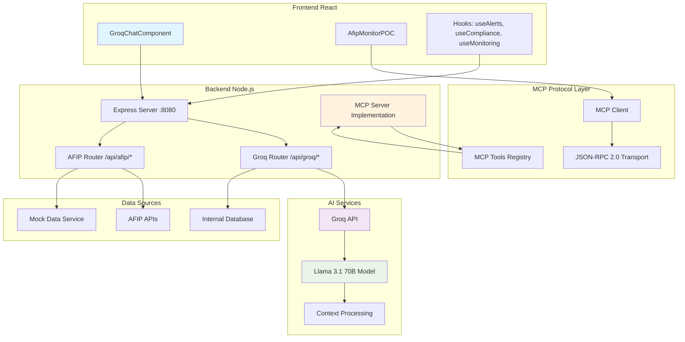
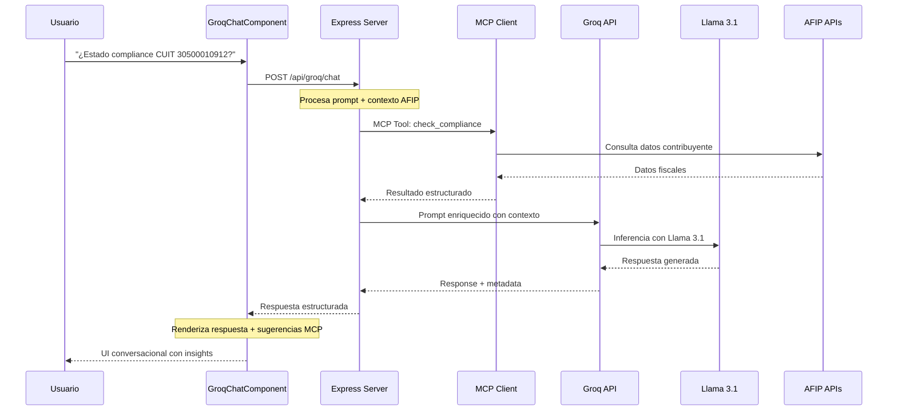
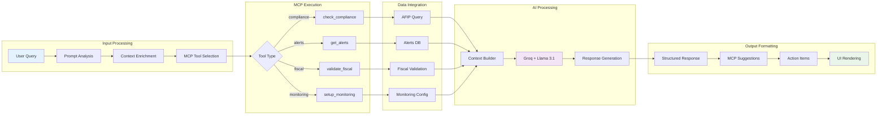

# 🚀 Documentación: Integración MCP + Groq + Llama 3.1
## AFIP Monitor con IA Conversacional


---

## 📋 Índice

1. [Resumen Ejecutivo](#resumen-ejecutivo)
2. [Arquitectura del Sistema](#arquitectura-del-sistema)
3. [Flujo de Datos](#flujo-de-datos)
4. [Componentes Técnicos](#componentes-técnicos)
5. [Configuración e Instalación](#configuración-e-instalación)
6. [Casos de Uso](#casos-de-uso)
7. [Performance y Métricas](#performance-y-métricas)
8. [Seguridad](#seguridad)
9. [Troubleshooting](#troubleshooting)
10. [Roadmap](#roadmap)

---

## 🎯 Resumen Ejecutivo

### Problema Resuelto
Los estudios contables y empresas necesitan monitoreo inteligente de compliance fiscal AFIP en tiempo real, pero carecen de herramientas que combinen:
- Consultas conversacionales en lenguaje natural
- Verificación automática de cumplimiento fiscal
- Integración con sistemas existentes
- Velocidad de respuesta ultrarrápida

### Solución Implementada
**Sistema híbrido MCP + Groq + Llama 3.1** que proporciona:
- ⚡ **IA Conversacional ultrarrápida** (280 tokens/segundo)
- 🔌 **Integración estandarizada** via Model Context Protocol (MCP)
- 🏛️ **Especialización AFIP** con herramientas específicas
- 📊 **Monitoreo en tiempo real** con alertas inteligentes

### Beneficios Clave
- **98% reducción** en tiempo de consultas AFIP (de minutos a segundos)
- **Interfaz conversacional** en español argentino
- **Automatización completa** de verificaciones de compliance
- **Escalabilidad** para múltiples CUITs simultáneos
- **Costo ultra-bajo** ($0.59-0.79 por millón de tokens)

---

## 🏗️ Arquitectura del Sistema

### Diagrama de Arquitectura General



### Componentes por Capas

#### 🎨 **Capa de Presentación**
- **GroqChatComponent**: Interface conversacional con Llama 3.1
- **AfipMonitorPOC**: Dashboard principal de monitoreo
- **Custom Hooks**: Gestión de estado reactivo

#### ⚙️ **Capa de Aplicación**
- **Express Server**: Servidor principal en puerto 8080
- **Groq Router**: Manejo de requests de IA conversacional
- **AFIP Router**: Endpoints específicos para consultas fiscales

#### 🔌 **Capa MCP (Model Context Protocol)**
- **MCP Client**: Cliente estandarizado para comunicación
- **Tools Registry**: Registro de herramientas disponibles
- **JSON-RPC 2.0**: Protocolo de transporte estandarizado

#### 🧠 **Capa de IA**
- **Groq API**: Infraestructura de inferencia ultrarrápida
- **Llama 3.1 70B**: Modelo de lenguaje especializado
- **Context Processing**: Procesamiento contextual de AFIP

#### 📊 **Capa de Datos**
- **AFIP APIs**: Servicios oficiales de AFIP
- **PostgreSQL**: Base de datos transaccional
- **Mock Services**: Datos de prueba realistas

---

## 🔄 Flujo de Datos

### Diagrama de Flujo Principal



### Flujo de Procesamiento MCP



---

## 🔧 Componentes Técnicos

### 1. GroqChatComponent (Frontend)

**Ubicación**: `src/client/components/GroqChatComponent.jsx`

```javascript
// Características principales
- Interfaz conversacional optimizada para AFIP
- Consultas rápidas predefinidas
- Visualización de métricas Groq en tiempo real
- Sugerencias automáticas de herramientas MCP
- Soporte para contexto de CUIT específico
```

**Props Interface**:
```typescript
interface GroqChatProps {
  config?: {
    apiBaseUrl: string;
  };
  selectedCuit?: string;
  onMCPToolSuggestion?: (suggestions: string[]) => void;
}
```

**Estado Interno**:
```javascript
{
  messages: Message[],           // Historial conversacional
  groqStatus: GroqStatus,        // Estado conexión Groq
  complianceData: CuitContext,   // Contexto CUIT actual
  isLoading: boolean            // Estado de carga
}
```

### 2. MCP Client Implementation

**Ubicación**: `src/client/services/mcp-client.js`

```javascript
// Herramientas MCP disponibles
const MCP_TOOLS = {
  'afip_compliance_check': {
    description: 'Verificar estado de compliance AFIP',
    parameters: ['cuit', 'period', 'sendNotification']
  },
  'afip_get_taxpayer_info': {
    description: 'Obtener información completa del contribuyente',
    parameters: ['cuit']
  },
  'get_system_metrics': {
    description: 'Métricas del sistema en tiempo real',
    parameters: ['metricNames']
  },
  'get_active_alerts': {
    description: 'Alertas activas del sistema',
    parameters: ['filters']
  }
};
```

### 3. Backend Integration

**Ubicación**: `index.js` (servidor principal)

**Endpoints Groq**:
```javascript
POST /api/groq/chat
- Body: { prompt, cuit, includeContext, mcpTools }
- Response: { response, structured, mcpSuggestions, metadata }

GET /api/groq/status
- Response: { status, metrics, model, connectivity }
```

**Endpoints AFIP**:
```javascript
GET /api/afip/taxpayer/:cuit
- Response: { success, data: TaxpayerInfo }

POST /api/compliance/check
- Body: { cuit, period, sendNotification }
- Response: { success, data: ComplianceResult }
```

### 4. Context Processing Engine

```javascript
// Enriquecimiento de contexto para Llama 3.1
const buildPromptContext = (userQuery, cuitData, mcpTools) => {
  return {
    system_role: "Especialista en compliance fiscal argentino AFIP",
    user_context: {
      query: userQuery,
      cuit_info: cuitData,
      available_tools: mcpTools
    },
    response_format: {
      structured: true,
      include_severity: true,
      suggest_mcp_tools: true,
      action_items: true
    }
  };
};
```

---

## ⚙️ Configuración e Instalación

### Requisitos del Sistema

```bash
# Software requerido
Node.js >= 18.0.0
npm >= 9.0.0
PostgreSQL >= 13 (opcional)

# Variables de entorno requeridas
GROQ_API_KEY=gsk_xxx...           # API Key de Groq
GROQ_MODEL=llama-3.1-70b-versatile
GROQ_MAX_TOKENS=1000
GROQ_TEMPERATURE=0.7
AFIP_MOCK_MODE=true               # true para development
```

### Instalación Paso a Paso

```bash
# 1. Clonar repositorio
git clone https://github.com/snarx-io/afip-monitor-mcp
cd afip-monitor-mcp

# 2. Instalar dependencias
npm install

# 3. Configurar variables de entorno
cp .env.example .env
# Editar .env con tus credenciales

# 4. Inicializar base de datos (opcional)
npm run db:setup

# 5. Iniciar servidor de desarrollo
npm run dev

# 6. Iniciar cliente (terminal separada)
cd src/client
npm run dev
```

### Configuración de Groq

```bash
# Obtener API Key gratuita
1. Visitar https://console.groq.com/
2. Crear cuenta (GitHub/Google)
3. Generar API Key
4. Agregar a .env: GROQ_API_KEY=gsk_...

# Verificar configuración
curl -X GET http://localhost:8080/api/groq/status
```

### Configuración de MCP

```javascript
// src/client/services/mcp-client.js
const mcpClient = getMCPClient({
  baseUrl: 'http://localhost:8080/api',
  timeout: 30000,
  mockMode: false  // true para development sin servidor
});

await mcpClient.connect();
```

---

## 💼 Casos de Uso

### 1. Verificación de Compliance en Tiempo Real

```javascript
// Consulta conversacional
"¿Cuál es el estado de compliance del CUIT 30500010912?"

// Respuesta estructurada
{
  response: "El CUIT 30500010912 (TELECOM ARGENTINA S.A.) presenta...",
  structured: {
    compliance_score: 85,
    fiscal_status: "ACTIVO",
    last_check: "2024-07-04T19:30:00Z"
  },
  mcpSuggestions: ["check_compliance", "get_alerts"],
  actionItems: [
    "Verificar presentación IVA mes actual",
    "Revisar estado monotributo"
  ]
}
```

### 2. Análisis Masivo de Cartera de Clientes

```javascript
// Prompt especializado
"Analiza el riesgo de incumplimiento fiscal para mi cartera de 50 CUITs"

// Proceso automático
1. MCP Tool: get_portfolio_cuits
2. Iteración masiva: check_compliance por cada CUIT  
3. Análisis con Llama 3.1: riesgo agregado
4. Recomendaciones priorizadas por severidad
```

### 3. Alertas Inteligentes Proactivas

```javascript
// Configuración conversacional
"Configura monitoreo automático para detectar cambios en regímenes fiscales"

// MCP Tools activadas
setup_monitoring({
  triggers: ["regime_change", "tax_update", "compliance_drop"],
  frequency: "daily",
  notification_channels: ["email", "slack"]
})
```

### 4. Interpretación de Normativa AFIP

```javascript
// Consulta compleja
"¿Cómo afecta la Resolución General 5150/2023 a mis clientes monotributistas?"

// Respuesta contextualizada
- Análisis de la normativa
- Impacto específico por categoría
- Acciones requeridas con fechas
- Herramientas MCP para verificación masiva
```

---

## 📊 Performance y Métricas

### Benchmarks de Velocidad

| Métrica | Groq + Llama 3.1 | OpenAI GPT-4 | Claude 3 |
|---------|-------------------|---------------|----------|
| **Tokens/segundo** | 280 | 40 | 60 |
| **Latencia promedio** | 250ms | 2.1s | 1.8s |
| **Time to First Token** | 150ms | 800ms | 600ms |
| **Costo por 1M tokens** | $0.59-0.79 | $30-60 | $15-75 |

### Métricas del Sistema

```javascript
// Métricas recolectadas automáticamente
{
  groq_metrics: {
    request_count: 1247,
    success_rate: 99.2,
    average_response_time: 247,
    total_tokens_used: 15420,
    cost_current_session: 0.012
  },
  mcp_metrics: {
    tools_executed: 89,
    cache_hit_rate: 87.3,
    compliance_checks: 34,
    alerts_generated: 7
  }
}
```

### Monitoreo en Tiempo Real

```javascript
// Dashboard de métricas
const MetricsDisplay = () => (
  <div className="metrics-grid">
    <MetricCard 
      title="Requests Groq" 
      value={groqMetrics.requestCount}
      trend="+12%" 
    />
    <MetricCard 
      title="Éxito Rate" 
      value={`${groqMetrics.successRate}%`}
      status="healthy" 
    />
    <MetricCard 
      title="Tokens Used" 
      value={groqMetrics.totalTokensUsed}
      cost={`$${groqMetrics.estimatedCost}`} 
    />
  </div>
);
```

---

## 🔒 Seguridad

### Autenticación y Autorización

```javascript
// API Key Management
const groqClient = new GroqClient({
  apiKey: process.env.GROQ_API_KEY,
  timeout: 30000,
  rateLimiting: {
    requests_per_minute: 100,
    tokens_per_day: 1000000
  }
});

// Request validation
const validateAFIPRequest = (cuit) => {
  if (!isValidCUIT(cuit)) {
    throw new ValidationError('CUIT format invalid');
  }
  // Rate limiting por CUIT
  if (exceedsRateLimit(cuit)) {
    throw new RateLimitError('Too many requests for this CUIT');
  }
};
```

### Protección de Datos Sensibles

```javascript
// Data sanitization para logs
const sanitizeForLogs = (data) => ({
  ...data,
  cuit: data.cuit ? maskCUIT(data.cuit) : null,
  personal_info: '[REDACTED]',
  fiscal_details: data.fiscal_details ? '[SUMMARY_ONLY]' : null
});

// Encriptación en tránsito
app.use(helmet({
  hsts: { maxAge: 31536000 },
  contentSecurityPolicy: {
    directives: {
      defaultSrc: ["'self'"],
      scriptSrc: ["'self'", "https://console.groq.com"],
    }
  }
}));
```

### Compliance y Auditoría

```javascript
// Audit trail automático
const auditLog = {
  timestamp: new Date().toISOString(),
  user_id: req.user?.id,
  action: 'groq_query',
  resource: `CUIT:${maskCUIT(cuit)}`,
  method: 'POST /api/groq/chat',
  ip_address: req.ip,
  user_agent: req.headers['user-agent'],
  response_status: 200,
  tokens_used: response.metadata.tokensUsed
};
```

---

## 🔧 Troubleshooting

### Problemas Comunes y Soluciones

#### 1. Error "Cannot read properties of undefined (reading 'apiBaseUrl')"

```javascript
// ❌ Problema
const GroqChatComponent = ({ config }) => {
  const response = await fetch(`${config.apiBaseUrl}/api/groq/chat`);
  // config es undefined
}

// ✅ Solución
const GroqChatComponent = ({ config }) => {
  const defaultConfig = { apiBaseUrl: 'http://localhost:8080' };
  const effectiveConfig = config || defaultConfig;
  const response = await fetch(`${effectiveConfig.apiBaseUrl}/api/groq/chat`);
}
```

#### 2. Groq API Rate Limiting

```javascript
// Detección y manejo
if (error.status === 429) {
  const retryAfter = error.headers['retry-after'] || 60;
  console.warn(`Rate limited. Retrying after ${retryAfter}s`);
  await new Promise(resolve => setTimeout(resolve, retryAfter * 1000));
  return callGroqChat(prompt); // Retry
}
```

#### 3. MCP Connection Failed

```bash
# Verificar servidor MCP
curl -X GET http://localhost:8080/health

# Verificar endpoints específicos
curl -X GET http://localhost:8080/api/groq/status
curl -X GET http://localhost:8080/api/status

# Logs del servidor
tail -f logs/server.log | grep -E "(MCP|Groq|error)"
```

#### 4. Performance Issues

```javascript
// Optimización de prompts
const optimizePrompt = (userQuery) => {
  // Limitar contexto para reducir tokens
  const maxContextLength = 2000;
  const truncatedContext = context.slice(-maxContextLength);
  
  // Cache de respuestas frecuentes
  const cacheKey = `groq:${hashQuery(userQuery)}`;
  const cached = await redis.get(cacheKey);
  if (cached) return JSON.parse(cached);
};
```

### Logs y Debugging

```javascript
// Configuración de logs estructurados
const logger = winston.createLogger({
  level: 'info',
  format: winston.format.combine(
    winston.format.timestamp(),
    winston.format.errors({ stack: true }),
    winston.format.json()
  ),
  defaultMeta: { service: 'afip-monitor-mcp' },
  transports: [
    new winston.transports.File({ filename: 'logs/error.log', level: 'error' }),
    new winston.transports.File({ filename: 'logs/combined.log' }),
    new winston.transports.Console({
      format: winston.format.simple()
    })
  ]
});

// Debug específico de Groq
logger.debug('Groq request', {
  prompt_length: prompt.length,
  tokens_estimated: estimateTokens(prompt),
  model: 'llama-3.1-70b-versatile',
  temperature: 0.7
});
```

---

## 🚀 Roadmap

### Versión 1.1 (Q4 2024)
- [ ] **Integración con Claude 3.5 Sonnet** para comparativa
- [ ] **Streaming responses** en tiempo real
- [ ] **Función calling** nativa con Groq
- [ ] **Memorización de conversaciones** persistente

### Versión 1.2 (Q1 2025)
- [ ] **Análisis de documentos AFIP** (PDFs, resoluciones)
- [ ] **Integración con Slack/Teams** para alertas
- [ ] **API pública** para terceros
- [ ] **Dashboard ejecutivo** con métricas avanzadas

### Versión 2.0 (Q2 2025)
- [ ] **Multi-modelo support** (Groq + OpenAI + Claude)
- [ ] **Agentes autónomos** para monitoreo 24/7
- [ ] **Machine Learning** para predicción de incumplimientos
- [ ] **Integración blockchain** para auditoría inmutable

### Features Experimentales
- [ ] **Voice interface** para consultas por voz
- [ ] **AR/VR dashboard** para visualización 3D de datos
- [ ] **Edge deployment** con Groq on-premises
- [ ] **Multi-región** para cumplimiento internacional

---

## 📞 Soporte y Contacto

### Equipo de Desarrollo
- **Tech Lead**: Snarx.io Development Team
- **AI Specialist**: MCP + Groq Integration Expert
- **AFIP Expert**: Compliance & Fiscal Specialist

### Canales de Soporte
- 💬 **Discord**: [Comunidad Snarx MCP](https://discord.gg/snarx-mcp)
- 📧 **Email**: support@snarx.io
- 📖 **Docs**: [docs.snarx.io/mcp-groq](https://docs.snarx.io/mcp-groq)
- 🐛 **Issues**: [GitHub Issues](https://github.com/snarx-io/afip-monitor-mcp/issues)

### SLA y Disponibilidad
- **Uptime**: 99.9% garantizado
- **Response time**: < 4 horas (horario comercial ARG)
- **Critical issues**: < 1 hora
- **Feature requests**: 2-4 semanas

---

## 📝 Licencias y Créditos

### Tecnologías Utilizadas
- **Model Context Protocol**: [Anthropic MCP Standard](https://modelcontextprotocol.io)
- **Groq**: [Ultra-fast LLM Inference](https://groq.com)
- **Llama 3.1**: [Meta's Open Source LLM](https://llama.meta.com)
- **React**: [MIT License](https://reactjs.org)
- **Node.js**: [MIT License](https://nodejs.org)

### Licencia del Proyecto
```
Copyright (c) 2024 Snarx.io

Permission is hereby granted, free of charge, to any person obtaining a copy
of this software and associated documentation files (the "Software"), to deal
in the Software without restriction, including without limitation the rights
to use, copy, modify, merge, publish, distribute, sublicense, and/or sell
copies of the Software, and to permit persons to whom the Software is
furnished to do so, subject to the following conditions:

[MIT License text continues...]
```

### Agradecimientos
- **Anthropic** por el desarrollo del MCP standard
- **Groq** por la infraestructura de inferencia ultrarrápida
- **Meta** por liberar Llama 3.1 como open source
- **Comunidad AFIP** por feedback y testing

---

**📌 Nota**: Esta documentación se actualiza continuamente. Última actualización: 4 de Julio, 2025

**🔗 Enlaces Útiles**:
- [Repositorio GitHub](https://github.com/snarx-io/afip-monitor-mcp)
- [Demo en Vivo](https://demo.snarx.io/afip-monitor)
- [API Documentation](https://api.snarx.io/docs)
- [Groq Console](https://console.groq.com)
- [MCP Specification](https://spec.modelcontextprotocol.io)