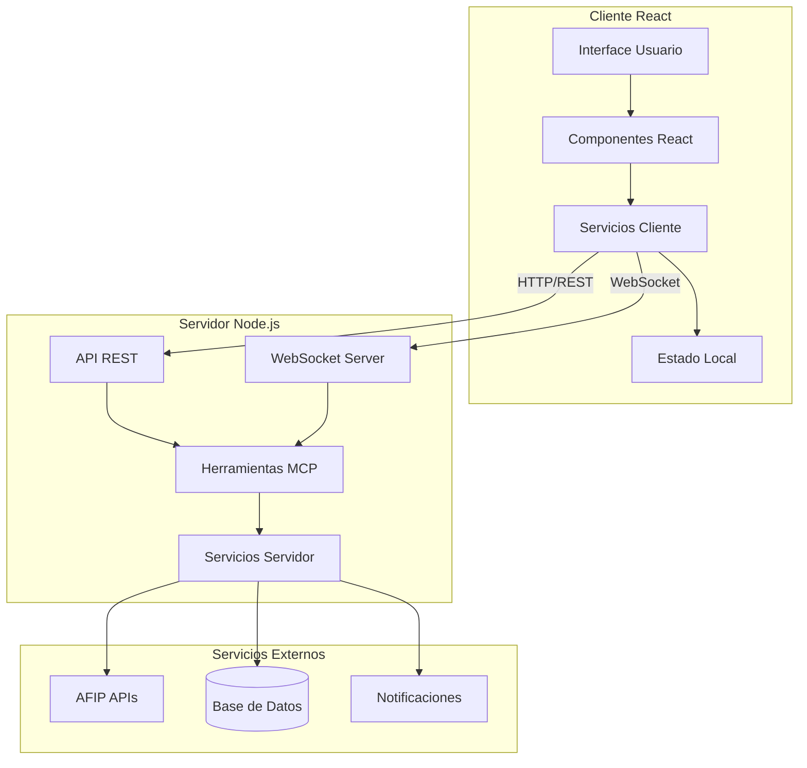
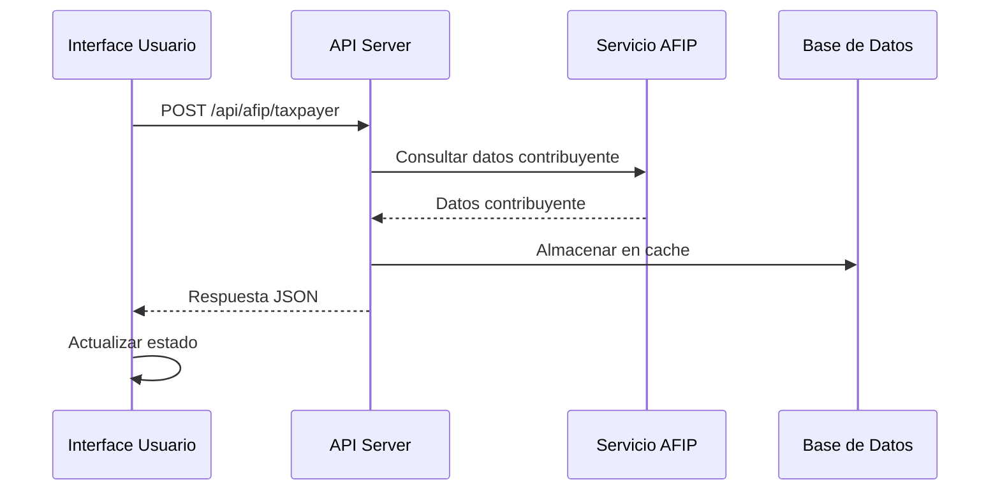
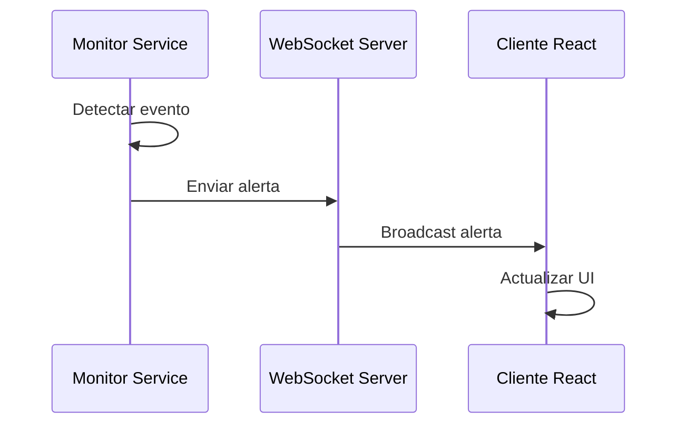
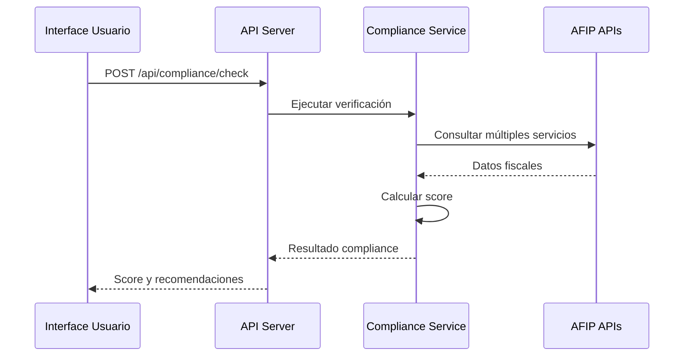
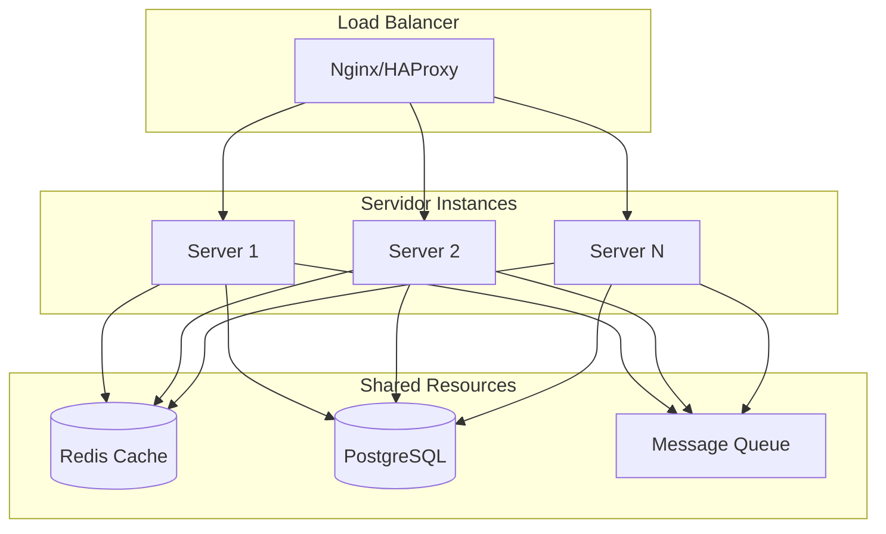
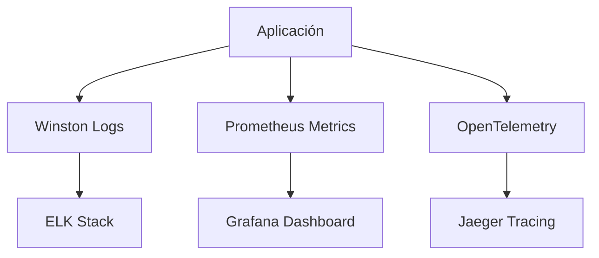

# Arquitectura AFIP Monitor MCP

## 📋 Índice

- [Visión General](#visión-general)
- [Arquitectura del Sistema](#arquitectura-del-sistema)
- [Componentes Principales](#componentes-principales)
- [Patrones de Diseño](#patrones-de-diseño)
- [Flujo de Datos](#flujo-de-datos)
- [Tecnologías Utilizadas](#tecnologías-utilizadas)
- [Decisiones de Diseño](#decisiones-de-diseño)
- [Escalabilidad](#escalabilidad)

---

## 🎯 Visión General

AFIP Monitor MCP es una **Proof of Concept (POC)** que implementa una arquitectura moderna para el monitoreo automático de servicios AFIP utilizando **Model Context Protocol (MCP)**. La aplicación sigue un patrón de arquitectura **cliente-servidor** con comunicación en tiempo real y principios de **Clean Architecture**.

### Objetivos Arquitectónicos

- **Separación de Responsabilidades**: Cliente y servidor independientes
- **Escalabilidad**: Arquitectura modular y extensible
- **Tiempo Real**: Comunicación bidireccional con WebSockets
- **Mobile First**: Diseño responsive desde dispositivos móviles
- **Clean Code**: Código mantenible y testeable

---

## 🏗️ Arquitectura del Sistema



### Capas Arquitectónicas

1. **Capa de Presentación** (Cliente React)
2. **Capa de API** (Servidor Express)
3. **Capa de Lógica de Negocio** (Servicios MCP)
4. **Capa de Datos** (Base de Datos + APIs Externas)

---

## 🔧 Componentes Principales

### 📱 Frontend (Cliente)

```
src/client/
├── components/          # Componentes React
│   ├── AfipMonitorPOC.jsx    # Componente principal
│   └── common/               # Componentes reutilizables
├── hooks/              # Custom hooks
├── services/           # Servicios de cliente
├── utils/              # Utilidades
├── main.jsx           # Punto de entrada
├── index.html         # HTML principal
└── index.css          # Estilos globales
```

#### Responsabilidades:
- **Interfaz de Usuario**: Presentación de datos y interacción
- **Estado Local**: Manejo de estado reactivo con React hooks
- **Comunicación**: HTTP requests y WebSocket connections
- **Validación**: Validación de formularios y datos de entrada

### 🖥️ Backend (Servidor)

```
src/server/
├── tools/              # Herramientas MCP
│   ├── base-tool.js         # Clase base para herramientas
│   └── check-compliance.js  # Herramienta de compliance
├── services/           # Servicios de negocio
│   ├── afip-client.js       # Cliente AFIP
│   └── alert-manager.js     # Gestor de alertas
├── models/             # Modelos de datos
├── utils/              # Utilidades del servidor
└── index.js           # Servidor principal
```

#### Responsabilidades:
- **API REST**: Endpoints para consultas y operaciones
- **WebSocket Server**: Comunicación en tiempo real
- **Herramientas MCP**: Implementación de capacidades específicas
- **Integración AFIP**: Simulación de servicios fiscales

### 📊 Servicios Compartidos

```
src/shared/
├── constants/          # Constantes globales
├── schemas/           # Esquemas de validación
└── types/             # Definiciones de tipos
```

---

## 🎨 Patrones de Diseño

### 1. **Model Context Protocol (MCP)**

```javascript
// Implementación de herramienta MCP
class CheckComplianceTool extends BaseTool {
  constructor(services) {
    super(
      'check_compliance',
      'Verifica el estado de compliance fiscal',
      inputSchema,
      services
    );
  }

  async execute(args) {
    // Lógica de verificación
    return await this.services.afip.checkCompliance(args);
  }
}
```

### 2. **Repository Pattern**

```javascript
// Abstracción de acceso a datos
class AfipRepository {
  async getTaxpayerInfo(cuit) {
    // Implementación específica
  }
  
  async getComplianceStatus(cuit, period) {
    // Implementación específica
  }
}
```

### 3. **Observer Pattern**

```javascript
// Sistema de alertas en tiempo real
class AlertManager {
  constructor() {
    this.subscribers = [];
  }
  
  subscribe(callback) {
    this.subscribers.push(callback);
  }
  
  notify(alert) {
    this.subscribers.forEach(callback => callback(alert));
  }
}
```

### 4. **Strategy Pattern**

```javascript
// Diferentes estrategias de notificación
class NotificationStrategy {
  sendEmail(alert) { /* implementación */ }
  sendWebSocket(alert) { /* implementación */ }
  sendSMS(alert) { /* implementación */ }
}
```

---

## 🔄 Flujo de Datos

### 1. **Flujo de Consulta AFIP**



### 2. **Flujo de Alertas en Tiempo Real**



### 3. **Flujo de Compliance Check**



---

## 🛠️ Tecnologías Utilizadas

### Frontend Stack
- **React 18**: Framework UI reactivo
- **Vite**: Build tool moderno y rápido
- **Tailwind CSS**: Framework CSS utility-first
- **WebSocket Client**: Comunicación en tiempo real

### Backend Stack
- **Node.js 18+**: Runtime JavaScript
- **Express.js**: Framework web minimalista
- **WebSocket**: Comunicación bidireccional
- **SQLite**: Base de datos local (desarrollo)

### Desarrollo
- **ES Modules**: Módulos JavaScript modernos
- **Hot Reload**: Desarrollo con recarga automática
- **ESLint**: Linting y calidad de código
- **Concurrently**: Ejecución paralela de procesos

---

## 🧠 Decisiones de Diseño

### 1. **Arquitectura Cliente-Servidor**

**Decisión**: Separar completamente cliente y servidor
**Justificación**: 
- Independencia de despliegue
- Escalabilidad horizontal
- Separación de responsabilidades
- Posibilidad de múltiples clientes

### 2. **WebSocket para Tiempo Real**

**Decisión**: Usar WebSocket para alertas
**Justificación**:
- Comunicación bidireccional
- Baja latencia
- Conexión persistente
- Escalable para múltiples clientes

### 3. **Tailwind CSS**

**Decisión**: Utility-first CSS framework
**Justificación**:
- Desarrollo rápido
- Consistencia visual
- Mobile-first por defecto
- Optimización automática

### 4. **Simulación AFIP**

**Decisión**: Mock services para POC
**Justificación**:
- Desarrollo sin dependencias externas
- Datos predecibles para testing
- Demostración de funcionalidad
- Fácil migración a servicios reales

### 5. **Estructura Modular**

**Decisión**: Organización por dominio
**Justificación**:
- Mantenibilidad
- Testabilidad
- Reutilización
- Escalabilidad

---

## 📈 Escalabilidad

### Escalabilidad Horizontal



### Estrategias de Escalabilidad

1. **Microservicios**: Dividir por dominio funcional
2. **Caching**: Redis para datos frecuentes
3. **Message Queue**: Para procesamiento asíncrono
4. **Database Sharding**: Para grandes volúmenes
5. **CDN**: Para assets estáticos

### Performance Optimizations

```javascript
// Lazy loading de componentes
const ComplianceChecker = lazy(() => import('./ComplianceChecker'));

// Memoización de cálculos pesados
const memoizedScore = useMemo(() => {
  return calculateComplianceScore(data);
}, [data]);

// Debouncing de búsquedas
const debouncedSearch = useCallback(
  debounce((query) => searchTaxpayers(query), 300),
  []
);
```

---

## 🔒 Seguridad

### Medidas Implementadas

1. **CORS**: Configuración restrictiva
2. **Rate Limiting**: Prevención de abuso
3. **Input Validation**: Sanitización de datos
4. **Environment Variables**: Configuración segura

### Mejoras Futuras

```javascript
// Autenticación JWT
const authenticate = (req, res, next) => {
  const token = req.header('Authorization');
  // Validar token
  next();
};

// Encriptación de datos sensibles
const encryptSensitiveData = (data) => {
  return crypto.encrypt(data, process.env.SECRET_KEY);
};
```

---

## 🧪 Testing Strategy

### Tipos de Testing

1. **Unit Tests**: Componentes individuales
2. **Integration Tests**: APIs y servicios
3. **E2E Tests**: Flujos completos
4. **Performance Tests**: Carga y estrés

### Estructura de Testing

```
tests/
├── unit/
│   ├── components/
│   ├── services/
│   └── utils/
├── integration/
│   ├── api/
│   └── websocket/
└── e2e/
    ├── compliance-flow.test.js
    └── taxpayer-query.test.js
```

---

## 📊 Monitoreo y Observabilidad

### Métricas Clave

1. **Performance**: Tiempo de respuesta, throughput
2. **Availability**: Uptime, health checks
3. **Errors**: Rate de errores, excepciones
4. **Business**: Compliance scores, alertas generadas

### Stack de Monitoreo



---

## 🚀 Deployment Architecture

### Desarrollo

```yaml
# docker-compose.dev.yml
version: '3.8'
services:
  client:
    build: ./client
    ports: ["3000:3000"]
  
  server:
    build: ./server
    ports: ["8080:8080"]
    environment:
      - NODE_ENV=development
```

### Producción

```yaml
# docker-compose.prod.yml
version: '3.8'
services:
  nginx:
    image: nginx:alpine
    ports: ["80:80", "443:443"]
  
  app:
    image: afip-monitor:latest
    environment:
      - NODE_ENV=production
```

---

## 📚 Referencias

- [Model Context Protocol Specification](https://spec.modelcontextprotocol.io/)
- [React 18 Documentation](https://react.dev/)
- [Express.js Guide](https://expressjs.com/)
- [WebSocket Protocol RFC](https://tools.ietf.org/html/rfc6455)
- [Clean Architecture Principles](https://blog.cleancoder.com/uncle-bob/2012/08/13/the-clean-architecture.html)

---

## 👥 Contribuciones

### Equipo de Desarrollo

**Snarx.io** - Especialistas en Model Context Protocol

- **Arquitecto Principal**: Diseño de arquitectura MCP
- **Frontend Developer**: Implementación React + Tailwind
- **Backend Developer**: API REST + WebSocket
- **DevOps Engineer**: Configuración Docker + CI/CD

### Próximos Pasos

1. **Microservicios**: Separar por dominio funcional
2. **Testing**: Implementar suite completa de tests
3. **Seguridad**: Autenticación y autorización
4. **Performance**: Optimizaciones y caching
5. **Monitoreo**: Observabilidad completa

---

*Esta documentación es un documento vivo que se actualiza con cada iteración del proyecto.*