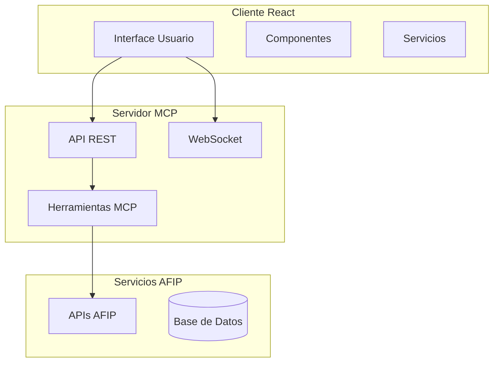

# AFIP Monitor MCP - POC

[](https://opensource.org/licenses/MIT)
[](https://nodejs.org/)
[](https://reactjs.org/)

Monitor automático AFIP con alertas proactivas y compliance checker desarrollado usando Model Context Protocol (MCP).

## 🎯 Características Principales

- **Monitor Automático**: Verificación continua del estado fiscal en AFIP
- **Alertas Proactivas**: Sistema inteligente de alertas con múltiples niveles de severidad
- **Compliance Checker**: Evaluación automática del cumplimiento de obligaciones fiscales
- **Dashboard en Tiempo Real**: Interface moderna y responsive (mobile-first)
- **Arquitectura MCP**: Implementación completa usando Model Context Protocol
- **Multi-transporte**: Soporte para WebSocket, HTTP y STDIO

## 🚀 Inicio Rápido

### Prerrequisitos

- Node.js 18+ 
- npm 9+
- Git

### Instalación

```bash
# Clonar el repositorio
git clone https://github.com/snarx-io/afip-monitor-mcp.git
cd afip-monitor-mcp

# Instalar dependencias
npm install

# Configurar variables de entorno
cp .env.example .env

# Ejecutar setup inicial
npm run setup

# Iniciar en modo desarrollo
npm run dev
```

### Inicio Rápido con Docker

```bash
# Construir y ejecutar con docker-compose
docker-compose up -d

# Ver logs
docker-compose logs -f
```

**Acceso a la aplicación:**
- **Cliente**: http://localhost:3000
- **Servidor**: http://localhost:8080
- **API Docs**: http://localhost:8080/docs

## 📊 Funcionalidades

### 🔍 Monitor Automático AFIP

- **Verificación de Estado Fiscal**: Monitoreo continuo del estado del contribuyente
- **Control de Inscripciones**: IVA, Ganancias, Seguridad Social
- **Seguimiento de Declaraciones**: Control automático de presentaciones
- **Detección de Cambios**: Alertas por modificaciones en regímenes fiscales

### 🚨 Sistema de Alertas Inteligente

- **Alertas por Severidad**: Crítica, Alta, Media, Baja, Informativa
- **Múltiples Canales**: Dashboard, Email, SMS, WebSocket
- **Auto-agrupación**: Consolidación inteligente de alertas similares
- **Escalamiento**: Escalado automático según criticidad y tiempo

### ✅ Compliance Checker

- **Score de Compliance**: Evaluación numérica del cumplimiento fiscal
- **Verificaciones Múltiples**: Estado fiscal, IVA, Ganancias, Seguridad Social
- **Recomendaciones**: Acciones sugeridas para mejorar compliance
- **Historial**: Tracking de evolución del compliance

### 📱 Dashboard Responsivo

- **Mobile-First**: Diseño optimizado para dispositivos móviles
- **Tiempo Real**: Actualizaciones automáticas vía WebSocket
- **Interfaz Intuitiva**: UX/UI diseñado para usuarios no técnicos
- **Temas**: Modo claro/oscuro disponible

## 🏗️ Arquitectura Técnica

### Stack Tecnológico

**Frontend:**
- React 18 + Vite
- Tailwind CSS
- WebSocket Client

**Backend:**
- Node.js 18+ + Express
- WebSocket Server
- SQLite (desarrollo)

**DevOps:**
- Docker + Docker Compose
- CI/CD con GitHub Actions
- Nginx (producción)

### Arquitectura MCP



## 🔧 Configuración

### Variables de Entorno

```env
# Servidor
NODE_ENV=development
PORT=8080
LOG_LEVEL=info

# Base de datos
DATABASE_URL=./data/afip_monitor.db

# AFIP (en producción)
AFIP_CERT_PATH=./certs/certificate.crt
AFIP_KEY_PATH=./certs/private.key
AFIP_PASSPHRASE=your_passphrase

# Cliente
VITE_API_BASE_URL=http://localhost:8080
VITE_WS_URL=ws://localhost:8080

# Notificaciones
SMTP_HOST=localhost
SMTP_PORT=587
SMTP_USER=
SMTP_PASS=
```

### Configuración Avanzada
Ver archivos en `/config/` para configuración detallada:
- `development.json`: Configuración de desarrollo
- `production.json`: Configuración de producción
- `compliance-rules.json`: Reglas de compliance personalizadas

## 🚀 Deployment

### Desarrollo Local

```bash
# Modo desarrollo con hot reload
npm run dev

# Solo servidor
npm run dev:server

# Solo cliente
npm run dev:client
```

### Producción

```bash
# Build para producción
npm run build

# Iniciar servidor de producción
npm start

# Con Docker
docker-compose --profile production up -d
```

### Deployment en Cloud
- **AWS**: Documentación en `/docs/deployment/aws.md`
- **Google Cloud**: Documentación en `/docs/deployment/gcp.md`
- **Azure**: Documentación en `/docs/deployment/azure.md`

## 📚 Documentación

- **[Instalación](docs/INSTALLATION.md)**: Guía detallada de instalación
- **[Diseño Arquitectura](docs/ARCHITECTURE.md)**: Documentación completa de arquitectura
- **[API Reference](docs/API.md)**: Documentación completa de la API
- **[Deployment](docs/DEPLOYMENT.md)**: Guías de deployment para diferentes plataformas
- **[Contributing](CONTRIBUTING.md)**: Guía para contribuidores

## 🧪 Testing

```bash
# Ejecutar tests unitarios
npm test

# Tests con watch mode
npm run test:watch

# Coverage report
npm run test:coverage

# Tests end-to-end
npm run test:e2e
```

## 🤝 Contribuir

1. Fork el proyecto
2. Crea una rama para tu feature (`git checkout -b feature/AmazingFeature`)
3. Commit tus cambios (`git commit -m 'Add some AmazingFeature'`)
4. Push a la rama (`git push origin feature/AmazingFeature`)
5. Abre un Pull Request

### Estándares de Código

- **ESLint**: Configuración estricta para calidad
- **Prettier**: Formateo automático de código
- **Clean Code**: Principios de código limpio
- **Conventional Commits**: Estándar para mensajes de commit

## 🔐 Seguridad

### Medidas Implementadas

- **CORS**: Configuración restrictiva
- **Rate Limiting**: Prevención de abuso de APIs
- **Input Validation**: Sanitización de datos de entrada
- **Environment Variables**: Configuración segura

### Reportar Vulnerabilidades

Para reportar vulnerabilidades de seguridad, envía un email a `security@snarx.io`

## 📈 Roadmap

### Versión 1.1 (Q1 2025)
- [ ] Autenticación JWT
- [ ] Tests unitarios completos
- [ ] Integración con AFIP real
- [ ] Notificaciones por email

### Versión 1.2 (Q2 2025)
- [ ] Microservicios
- [ ] Cache Redis
- [ ] Monitoring Grafana
- [ ] Multi-tenant

### Versión 2.0 (Q3 2025)
- [ ] Machine Learning para predicciones
- [ ] API GraphQL
- [ ] Mobile App React Native
- [ ] Blockchain para auditoría

## 📄 Licencia

Distribuido bajo la Licencia MIT. Ver `LICENSE` para más información.

## 👥 Equipo

**Snarx.io** - Especialistas en Model Context Protocol y desarrollo de aplicaciones de IA

- **Website**: [snarx.io](https://snarx.io)
- **Email**: hello@snarx.io
- **LinkedIn**: [/company/snarx](https://linkedin.com/company/snarx)
- **GitHub**: [/snarx-io](https://github.com/snarx-io)

### Desarrolladores Principales

- **Arquitecto Principal**: Diseño de arquitectura MCP
- **Frontend Lead**: React + Tailwind implementation
- **Backend Lead**: Node.js + Express + WebSocket
- **DevOps Engineer**: Docker + CI/CD setup

## 🙏 Reconocimientos

- [Anthropic](https://anthropic.com) por el desarrollo del Model Context Protocol
- [AFIP](https://afip.gob.ar) por la documentación de APIs (simuladas en esta POC)
- Comunidad open source por las herramientas y librerías utilizadas
- [React Team](https://react.dev) por el framework
- [Tailwind CSS](https://tailwindcss.com) por el framework CSS

## 📊 Estadísticas del Proyecto


---

**⚠️ Nota Importante**: Esta es una Proof of Concept (POC) que simula la integración con AFIP para propósitos demostrativos. En producción se requiere certificado digital y credenciales válidas de AFIP.

**🔗 Model Context Protocol**: Este proyecto demuestra una implementación completa y robusta de MCP para casos de uso reales en el dominio fiscal argentino.

**🚀 Desarrollado con ❤️ por Snarx.io**